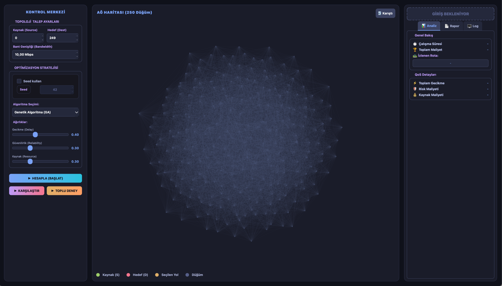
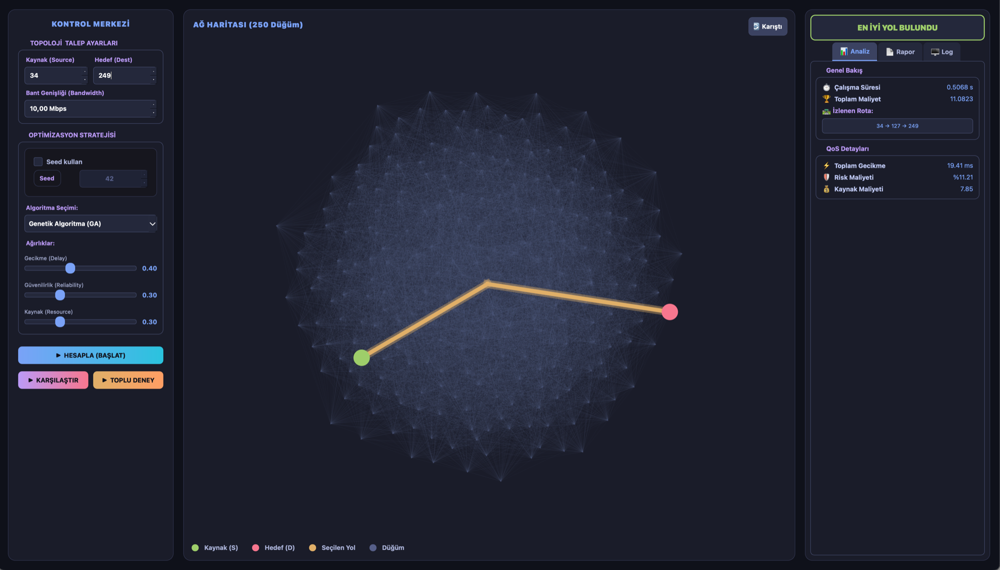
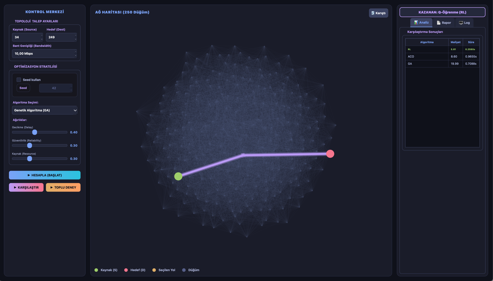
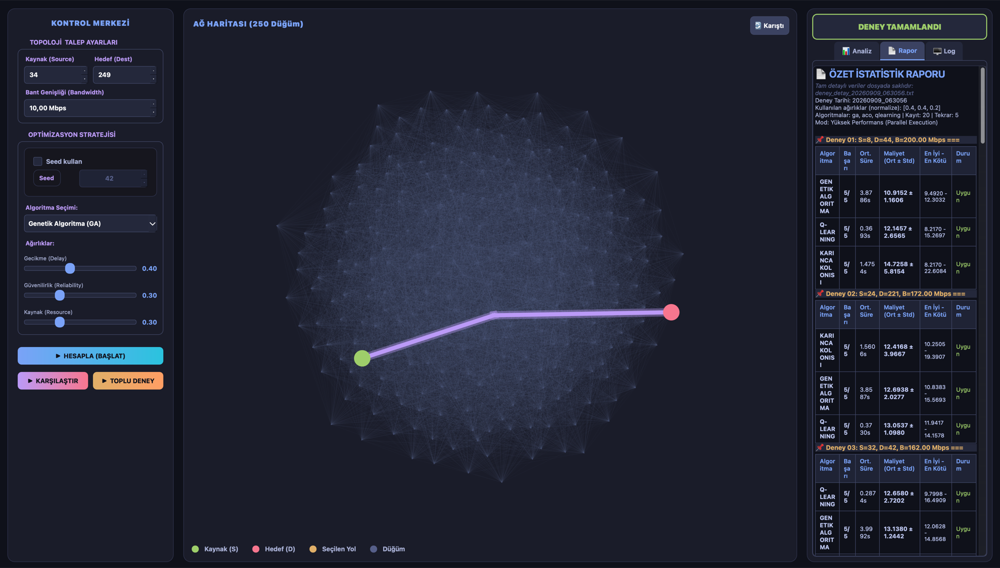
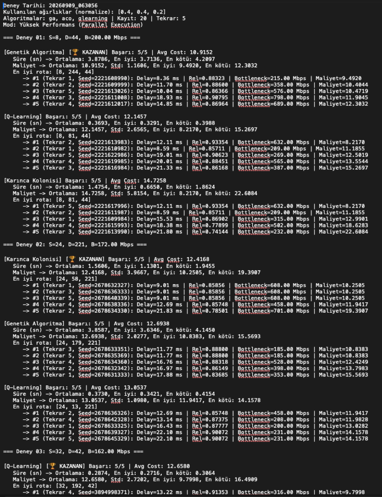

# Bilgisayar Ağları - Rota Optimizasyon Projesi

BSM307/317 dönem projesi kapsamında üç farklı rota bulma algoritmasının (Genetik Algoritma, Karınca Kolonisi Optimizasyonu, Q-Learning) aynı ağ topolojisi üzerinde performans karşılaştırması yapılmaktadır.

## 📋 Proje Özeti

Bu proje, ağ topolojisinde optimal rota bulma problemini çözmek için üç farklı algoritmanın etkinliğini karşılaştırır:
- **Genetik Algoritma (GA)**: Evrimsel optimizasyon yaklaşımı
- **Karınca Kolonisi Optimizasyonu (ACO)**: Doğa esinlenmeli sürü zekası algoritması  
- **Q-Learning**: Pekiştirmeli öğrenme tabanlı yaklaşım

## 🖼️ Ekran Görüntüleri

Aşağıdaki görseller `main_gui.py` üzerinden alınmıştır (250 düğümlü topoloji).

### 1. Başlangıç Ekranı — Ağ Haritası

Uygulama açıldığında 250 düğümlü ağ topolojisi çizilir. Sol panelden kaynak/hedef düğüm,
talep edilen bant genişliği, algoritma ve QoS ağırlıkları (gecikme / güvenilirlik / kaynak) seçilir.

<p align="center">
  
</p>

### 2. Tek Algoritma Çalıştırma — En İyi Yol

**HESAPLA (BAŞLAT)** ile seçili algoritma çalıştırılır. Bulunan rota harita üzerinde vurgulanır;
sağ panelde çalışma süresi, toplam maliyet, izlenen rota ve QoS detayları (gecikme, risk, kaynak maliyeti) listelenir.

<p align="center">
  
</p>

### 3. Algoritma Karşılaştırma

**KARŞILAŞTIR** butonu üç algoritmayı (GA, ACO, Q-Learning) aynı talep üzerinde arka arkaya çalıştırır ve
maliyet/süre tablosunu üreterek kazananı belirler.

<p align="center">
  
</p>

### 4. Toplu Deney ve Özet Rapor

**TOPLU DENEY** çok sayıda talebi tekrarlı olarak (paralel yürütme ile) çalıştırır. Rapor sekmesinde her deney için
başarı oranı, ortalama süre, ortalama maliyet ± standart sapma ve en iyi/en kötü değerler tablo halinde sunulur.

<p align="center">
  
</p>

## 🛠️ Sistem Gereksinimleri

### Python Sürümü
- **Python 3.10+** (önerilen)

### Gerekli Kütüphaneler
```bash
pip install pandas networkx matplotlib numpy PySide6
```

### Veri Dosyaları
Proje kökünde aşağıdaki CSV dosyaları bulunmalıdır:
- `BSM307_317_Guz2025_TermProject_NodeData.csv` - Düğüm verileri
- `BSM307_317_Guz2025_TermProject_EdgeData.csv` - Bağlantı verileri  
- `BSM307_317_Guz2025_TermProject_DemandData.csv` - Talep verileri

## 🚀 Kurulum ve Çalıştırma

### 1. Projeyi İndirin
```bash
git clone <repository-url>
cd bilgisayarAglari
```

### 2. Bağımlılıkları Yükleyin
```bash
# Tüm gerekli kütüphaneleri yükle
pip install pandas networkx matplotlib numpy PySide6

# Alternatif olarak virtual environment kullanın
python -m venv .venv
source .venv/bin/activate  # Linux/Mac
# veya
.venv\Scripts\activate     # Windows

pip install pandas networkx matplotlib numpy PySide6
```

### 3. Veri Dosyalarını Kontrol Edin
Proje kökünde CSV dosyalarının bulunduğundan emin olun.

## 🎮 Kullanım Seçenekleri

### A) Grafik Arayüz (GUI) - Önerilen
```bash
python main_gui.py
```
- Kullanıcı dostu arayüz
- Algoritma parametrelerini kolayca ayarlama
- Sonuçları görsel olarak karşılaştırma
- Gerçek zamanlı performans izleme

### B) Komut Satırı - Tek Algoritma
```bash
# Genetik Algoritma
python genetik_proje.py

# Karınca Kolonisi Optimizasyonu  
python karinca.py

# Q-Learning
python q_learning.py
```

## 🧪 Deney Düzeneği (deney_duzenegi.py)

## 🔄 Tekrarlanabilirlik (Seed Bilgisi)

Tüm algoritmalar Python'un `random` modülünü kullanır. Aynı seed değeriyle çalıştırıldığında sonuçlar tamamen tekrarlanabilir olur.

### Seed Kullanımı
```bash
# Sabit sonuçlar için
python deney_duzenegi.py --seed 42 --demands 20 --repeats 5

# Farklı seed değerleri
python deney_duzenegi.py --seed 123 --demands 20 --repeats 5
python deney_duzenegi.py --seed 456 --demands 20 --repeats 5
```

### Seed Olmadan
```bash
# Her çalıştırmada farklı sonuçlar
python deney_duzenegi.py --demands 20 --repeats 5
```

**Not**: Seed verilmezse sistem saatine göre rastgele değerler üretilir. Q-Learning için ek numpy rastgeleliği de aynı seed ile kontrol edilir.

## 📊 Rapor Analizi

### Rapor Dosyası Formatı
Deney düzeneği `deney_detay_YYYYMMDD_HHMMSS.txt` formatında detaylı rapor üretir.

### Rapor İçeriği
Her deney kombinasyonu için:
- **Başlangıç/Hedef**: Kaynak ve hedef düğümler
- **Talep**: İstenen bant genişliği
- **Algoritma Performansı**: 
  - Başarı oranı
  - Ortalama çalışma süresi
  - Ortalama maliyet
  - Standart sapma
  - En iyi/kötü sonuçlar
- **QoS Metrikleri**:
  - Gecikme (ms)
  - Güvenilirlik
  - Darboğaz bant genişliği
  - Toplam maliyet
- **Hata Analizi**: Başarısız tekrarların gerekçeleri

### Rapor Örneği
```
=== DENEY: Kaynak=15, Hedef=89, Talep=45.2 Mbps ===

Genetik Algoritma:
  ✓ Başarı: 8/10 (%80)
  ⏱ Ortalama Süre: 2.34s (±0.45s)
  💰 Ortalama Maliyet: 156.78 (±23.45)
  🏆 En İyi: 134.56, En Kötü: 189.23

Karınca Kolonisi:
  ✓ Başarı: 9/10 (%90)  
  ⏱ Ortalama Süre: 1.87s (±0.32s)
  💰 Ortalama Maliyet: 142.33 (±18.67)
  🏆 En İyi: 128.45, En Kötü: 167.89
```

### Detaylı Çıktı Örneği

Deney düzeneği, GUI'deki özet tablonun yanı sıra her tekrarın seed'ini, gecikmesini, güvenilirliğini,
darboğaz bant genişliğini ve maliyetini içeren tam detaylı bir metin raporu üretir:

<p align="center">
  
</p>

## 📁 Proje Yapısı

```
bilgisayarAglari/
├── 📄 README.md                    # Bu dosya
├── 🐍 ag.py                        # Ağ topolojisi oluşturucu
├── 🧬 genetik_proje.py             # Genetik Algoritma
├── 🐜 karinca.py                   # Karınca Kolonisi Optimizasyonu
├── 🧠 q_learning.py                # Q-Learning Algoritması
├── 🔬 deney_duzenegi.py            # Otomatik deney sistemi
├── 🖥️ main_gui.py                  # Grafik kullanıcı arayüzü
├── 📊 BSM307_317_Guz2025_TermProject_NodeData.csv
├── 📊 BSM307_317_Guz2025_TermProject_EdgeData.csv
├── 📊 BSM307_317_Guz2025_TermProject_DemandData.csv
├── 📁 data/                        # Ek veri dosyaları
├── 📁 docs/gorseller/              # README ekran görüntüleri
├── 📁 rapor/                       # Rapor çıktıları
└── 📁 __pycache__/                 # Python cache dosyaları
```

## 🎯 Algoritma Detayları

### Genetik Algoritma (genetik_proje.py)
- **Popülasyon tabanlı**: Çoklu çözüm adayı
- **Evrimsel operatörler**: Seçim, çaprazlama, mutasyon
- **Elitizm**: En iyi bireyleri koruma
- **Parametreler**: Popülasyon boyutu, nesil sayısı, mutasyon/çaprazlama oranları

### Karınca Kolonisi (karinca.py)  
- **Feromon tabanlı**: Deneyim paylaşımı
- **Sezgisel bilgi**: Yerel optimizasyon
- **Dinamik arama**: Keşif/sömürü dengesi
- **Parametreler**: Karınca sayısı, feromon ağırlıkları, buharlaşma oranı

### Q-Learning (q_learning.py)
- **Pekiştirmeli öğrenme**: Deneme-yanılma
- **Q-tablosu**: Durum-eylem değerleri
- **Epsilon-greedy**: Keşif stratejisi
- **Parametreler**: Öğrenme oranı, indirim faktörü, keşif oranı

## 🔧 Sorun Giderme

### Yaygın Hatalar

#### 1. Modül Bulunamadı
```bash
ModuleNotFoundError: No module named 'pandas'
```
**Çözüm**: Gerekli kütüphaneleri yükleyin
```bash
pip install pandas networkx matplotlib numpy PySide6
```

#### 2. CSV Dosyası Bulunamadı
```bash
FileNotFoundError: BSM307_317_Guz2025_TermProject_NodeData.csv
```
**Çözüm**: CSV dosyalarının proje kökünde olduğundan emin olun

#### 3. GUI Açılmıyor
```bash
ImportError: No module named 'PySide6'
```
**Çözüm**: PySide6 yükleyin
```bash
pip install PySide6
```

#### 4. Performans Sorunları
- Büyük ağlarda algoritma parametrelerini azaltın
- `--parallel` seçeneğini kullanın
- Demand sayısını düşürün

### Performans İpuçları

1. **Hızlı Test**: Az demand, az tekrar
2. **Kapsamlı Analiz**: Paralel işlem kullanın
3. **Bellek Optimizasyonu**: Büyük ağlarda parametreleri ayarlayın
4. **Sonuç Karşılaştırması**: Aynı seed değerini kullanın

## 📈 Sonuç Değerlendirmesi

### Başarı Kriterleri
- **Bant Genişliği**: Talep edilen değeri karşılama
- **Gecikme**: Minimum toplam gecikme
- **Güvenilirlik**: Yüksek güvenilirlik değeri
- **Kaynak Kullanımı**: Optimal kaynak tüketimi

### Karşılaştırma Metrikleri
- **Başarı Oranı**: Geçerli çözüm bulma yüzdesi
- **Çalışma Süresi**: Algoritma performansı
- **Çözüm Kalitesi**: Maliyet fonksiyonu değeri
- **Kararlılık**: Standart sapma değerleri

## 👥 Katkıda Bulunma

Bu proje BSM307/317 dönem projesi kapsamında geliştirilmiştir. Katkılar ve öneriler için:

1. Projeyi fork edin
2. Yeni özellik dalı oluşturun (`git checkout -b yeni-ozellik`)
3. Değişikliklerinizi commit edin (`git commit -am 'Yeni özellik eklendi'`)
4. Dalınızı push edin (`git push origin yeni-ozellik`)
5. Pull Request oluşturun

## 📄 Lisans

Bu proje eğitim amaçlı geliştirilmiştir. Akademik kullanım için serbesttir.

---

**Son Güncelleme**: 31 Aralık 2025  
**Proje Durumu**: Aktif Geliştirme  
**Python Sürümü**: 3.10+